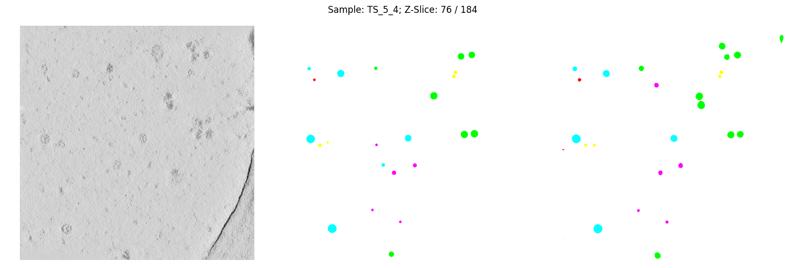

# CZII - CryoET Object Identification

## 98th place solution: https://www.kaggle.com/competitions/czii-cryo-et-object-identification/discussion/561878

## Approach: Single 3D-UNet to detect segmentation masks & run connected-components-3d to localize detections

- 7-fold-CV: Train on patches from 6 samples  
- Validate on patches from hold-out sample  
- Save predictions from hold-out fold to disc
- After 7-folds run connected-components-3D & competition metric on all predictions at once to get final score

### CV-score: 0.7781; Public-LB: 0.72782; Private-LB: 0.71783  

### What improved CV:  

- Larger patches (128 > 96 > 48)  
- Loss: 0.75 cross-entropy (without weights) + 0.25 dice loss (excluding background)  
- Masked loss: use only the inner (96, 96, 96) for loss as partially visible targets at the border lack context  
- Use the same mask for assigning predictions to reduce border artifacts  
- WeightedRandomSampler: upsample patches with targets such that each target is present in patches as many times as patches with only background (most)  
- Augmentations: RandFlipd (x, y, z), RandRotated (only z), RandGaussianNoised (mean=0.0, std=0.075), RandAdjustContrastd (gamma=(0.9, 1.1))  
- Lower train stride to get more patches to sample from (32)
- Individual radius for creating segmentation masks (apo-ferritin: 5, beta-galactosidase: 6, ribosome: 10, thyroglobulin: 6, virus-like-particle: 12)  
- Simple UNet: channels=(32, 64, 128, 256, 512), strides=(2, 2, 1, 1), dropout=0.2, num_res_units=1)  
- Adam optimizer; 40 epochs; learning rate 5e-4, 1215 (1456) training (full-training) samples per epoch
- LR-Scheduler: OneCycleLR  

### What did not work:  

- TverskyLoss, DiceFocalLoss, weights in dice loss  
- Other models like AttentionUnet
- RandCoarseDropoutd, RandAdjustContrastd with lower/higher values, RandRotated around x/y
- Removing smaller or larger connected-components based on threshold  
